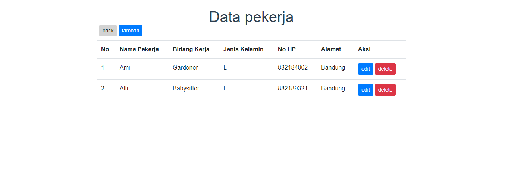
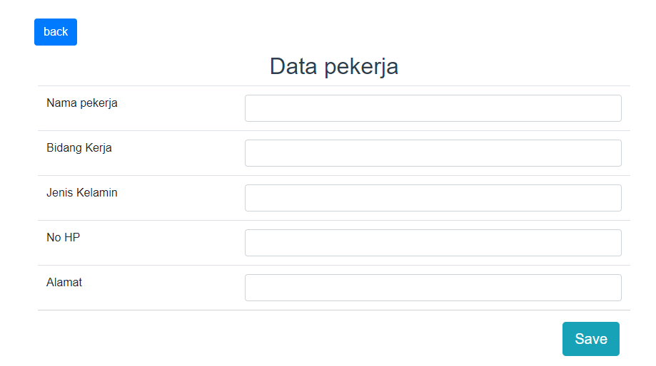
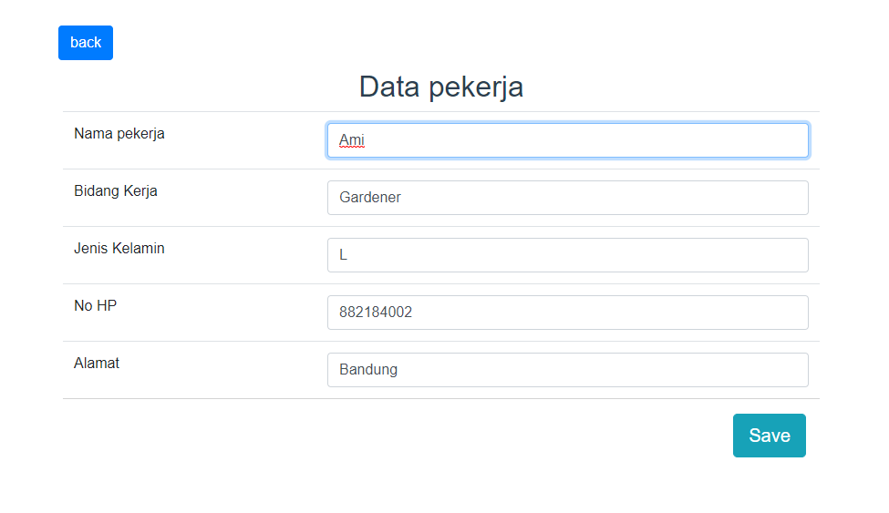
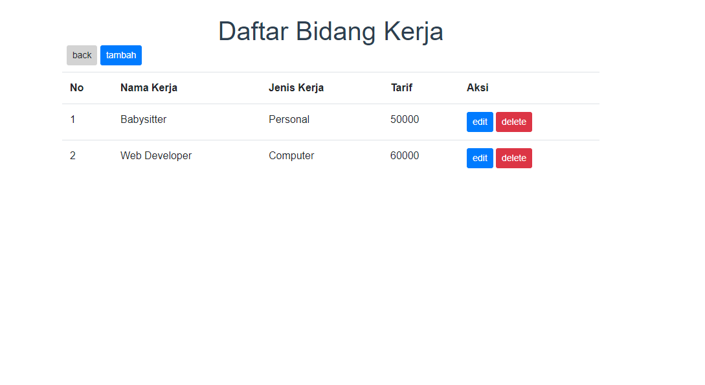
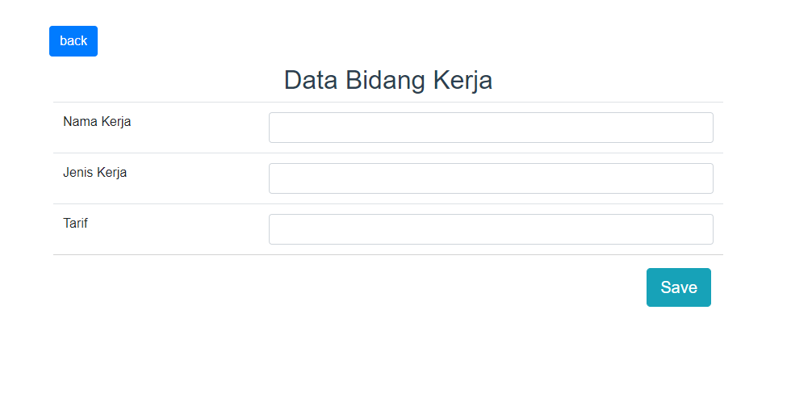
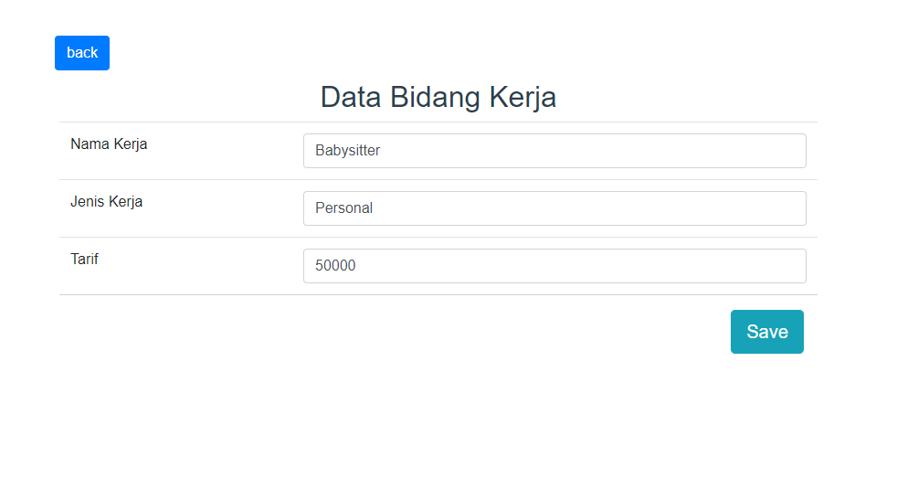

# Tugas Akhir Pwd
1617116703 Amillio

Aplikasi ini berbasis web dibuat dengan backend lumen dan frontend vue . Aplikasi ini digunakan untuk menyimpan data mengenai pesan jasa.
Seperti : 
1. Pekerja
          
2. Bidang Kerja
          


Backend gunakan base url localhost;

Steps : 


## Build Setup

``` bash
# install dependencies
npm install

# serve with hot reload at localhost:8080
npm run dev

# build for production with minification
npm run build

# build for production and view the bundle analyzer report
npm run build --report

# run unit tests
npm run unit

# run e2e tests
npm run e2e

# run all tests
npm test
```

For a detailed explanation on how things work, check out the [guide](http://vuejs-templates.github.io/webpack/) and [docs for vue-loader](http://vuejs.github.io/vue-loader).

# UI APLIKASI

## 1. Beranda
Beranda ini berisi pilihan untuk melihat data apa yang dituju.


## 2. Read Data (Pekerja)
Sebuah page yang berisi data data pekerja yang didalamnya dapat melakukan sebuah crud.


## 3. Create Data (Pekerja)
Sebuah page form untuk melakukan sebuah penambahan data pekerja dan lansung bertambah kedatabase.


## 4. Edit Data (Pekerja)
Sebuah page form untuk melakukan sebuah Perubahan han data anggota dan lansung berubah didatabasenya pun .


## 2. Read Data (BidangKerja)
Sebuah page yang berisi data data bidangkerja yang didalamnya dapat melakukan sebuah crud.


## 3. Create Data (BidangKerja)
Sebuah page form untuk melakukan sebuah penambahan data bidangkerja dan lansung bertambah kedatabase.


## 4. Edit Data (BidangKerja)
Sebuah page form untuk melakukan sebuah Perubahan data bidangkerja dan lansung berubah didatabasenya pun .

